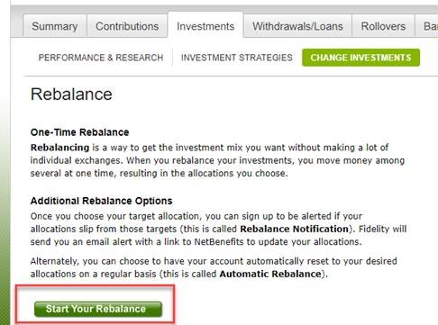
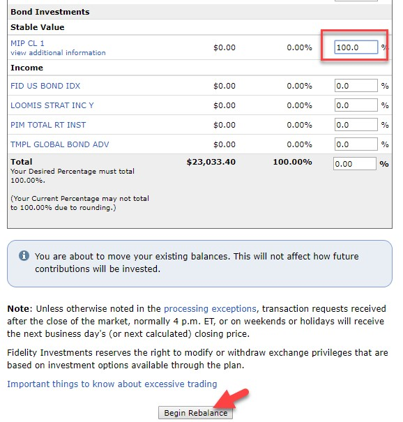

# Conservative Investment Option in 401K

If you want to keep your 401(K) investment stably during bear market, you can choose to rebalance your money into a stable value fund.

## Steps to rebalance 401(k) investment into a stable value fund

Take Fedelity as an example, you can follow the below steps to rebalance your 401(K) investment into a stable value fund called [MIP CL 1](mip-cp-1-overview.md).

1. Login Fidelity
2. Choose your 401(k) account and click "View balances"

3. Switch to the "Investments" tab
4. Choose "Change Your Investments"

5. Choose the "Exchange Multiple Investments" option
6. Change Investments
7. Start Your Rebalance

8. Scroll down to **Stable Value**, and on **MIP CL 1** option put the percentage you want (e.g., 100%)
9. Click "Begin Rebalance"

## Credit

This post is from my friend Yihai Zhu.